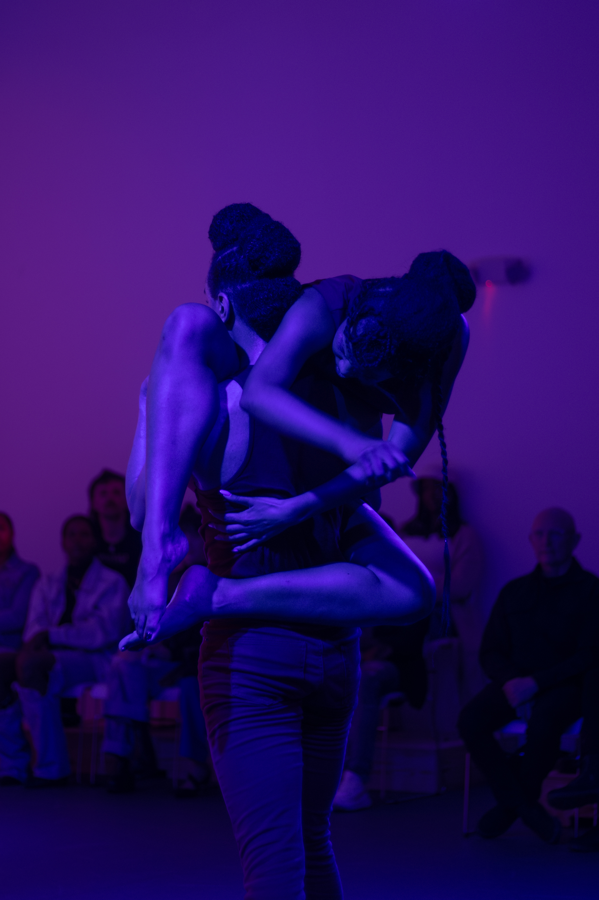
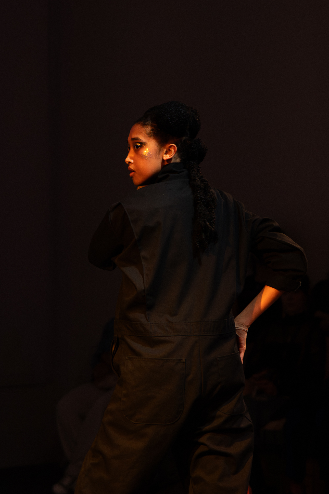
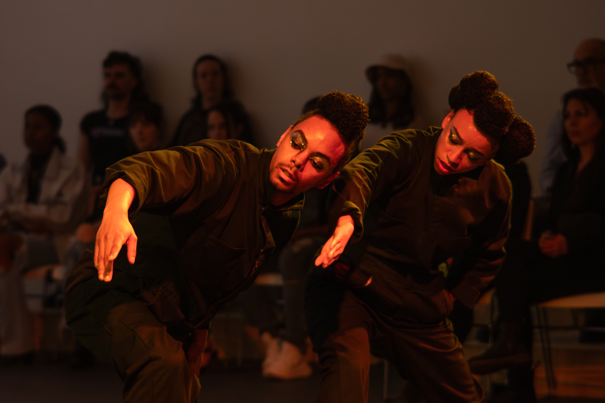
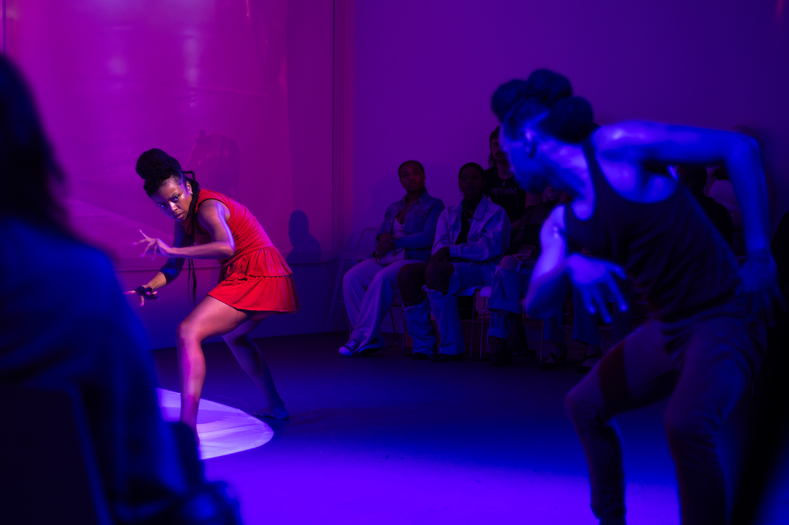
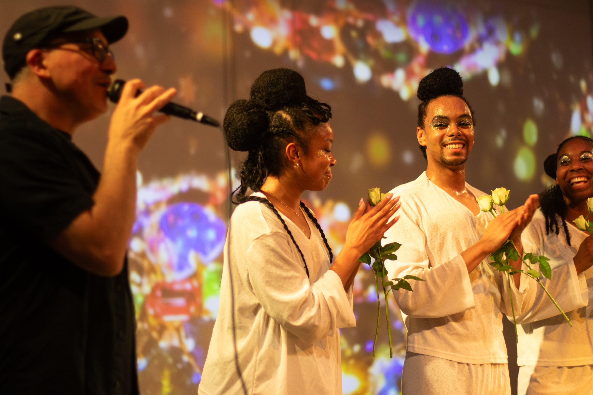

# Sum of Y'all

I had never known about <a href="https://www.pearlartsmovement.org">Pearl Arts - Movement and Sound</a> before, but after meeting Herman and Staycee I knew it was going to be a fun project. The goal was to create a lighting, projection, sound and dance performance where each element interacted with the others. After building an updated lighting plot on, my main focus was to build cues that aligned with the beautiful projections of <a href="https://stage.scottnandrew.com/statement">Scott Andrew</a>. The process involved working section by section with Andrew so that each video had corresponding lighting; matching hues, timings, and transitions. Around tech week we met the rest of the team and the dancers, all of which were great at what they did and were always ready to work with any tech issues we came across. In the end the show went great, we sold out nearly every show!

  <iframe 
    src="https://www.youtube.com/embed/gEQPG_13CnE?autoplay=1&mute=1&loop=1&playlist=gEQPG_13CnE&controls=0&modestbranding=1&rel=0&showinfo=0&iv_load_policy=3&disablekb=1&fs=0&playsinline=1" 
    title="YouTube video player" 
    style="position: absolute; top: 0; left: 0; width: 100%; height: 100%; border: none;"
    allow="accelerometer; autoplay; clipboard-write; encrypted-media; gyroscope; picture-in-picture" 
    allowfullscreen
  ></iframe>

*Photos by Liam Lyons IV*

*Poster by Pearl Arts*

